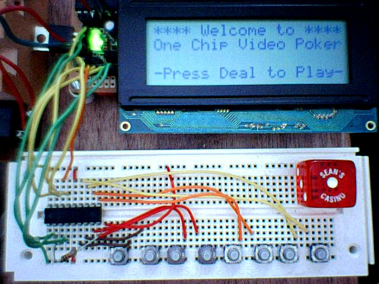
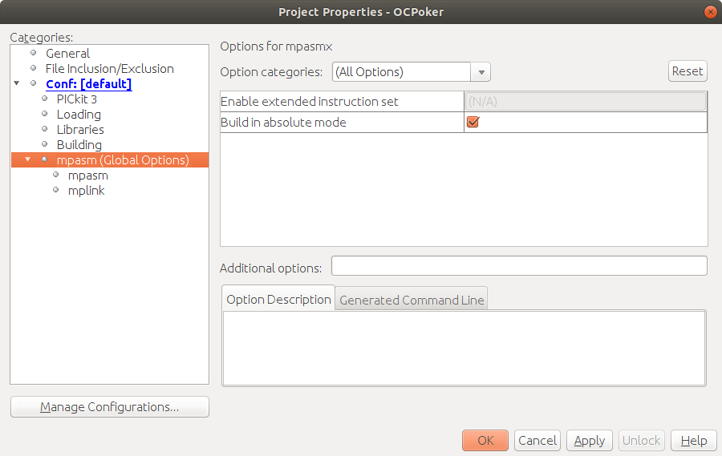

# vpokF628

## "One Chip Video Poker"

PIC 16f628 video poker game for 4x20 character LCD

Project I wrote in from 2002-2005 in various forms. The one given here was documented on a hand-written website that's now down but preserved in this project's "website" directory.

Intended to be an entertaining, informative project for beginners to microcontroller (and assembly language) programming.

This is mostly of historical interest, but...

16F628s are still available as of this writing on 8/15/2019 and I believe the original assembly should work with the newest MPLABX and PicKit3, which I have lying around. 

**We will see!**

And indeed yes - the secret is to end-run the linker and build like it was done in the old days - "Build in Absolute Mode" in MPASM global settings in Project Properties:

I was able to build this project by importing the old mcp/mcw project files (File | Import | MPLAB v8 IDE), choosing device family of PIC mid-range, device 16F628 (should probably bump to A.)
 
